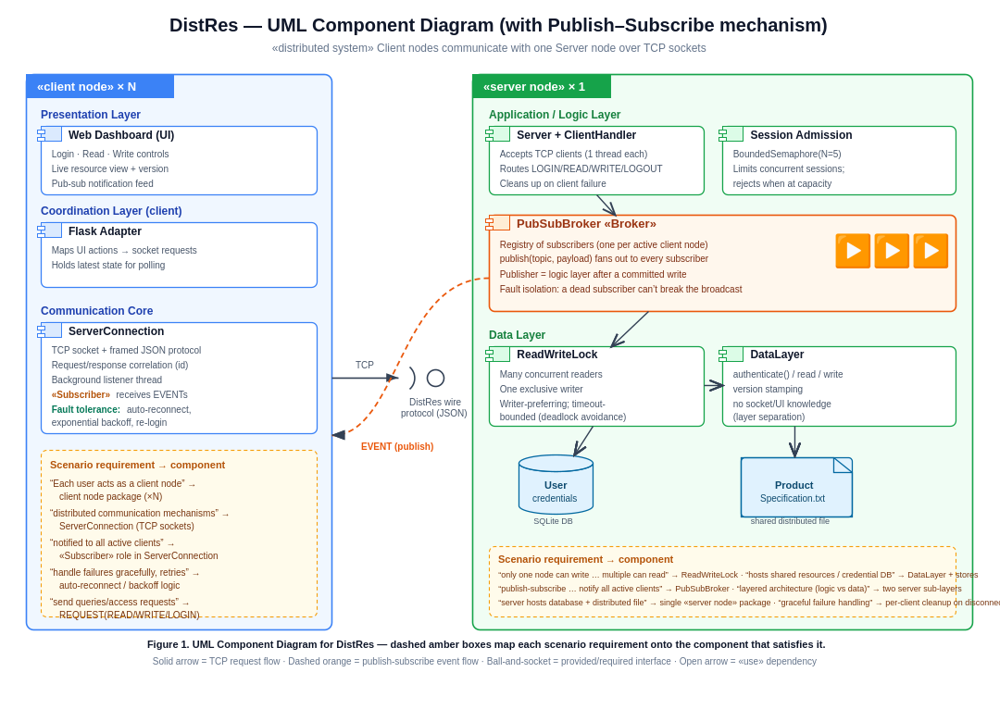

# DistRes - Distributed Resource Access and Synchronisation Engine

**6CM604 - Concurrency and Communication | Course Work 2 (Distributed Systems)**
Student ID: 100716820

DistRes is the distributed (v2) follow-on to the ConRes concurrent engine from
Course Work 1. Several **client nodes** connect over TCP to a single
**server node** and share safe, coordinated read/write access to a credential
database and a shared specification file. Every write sends a metadata-only
notification to all connected clients through a publish-subscribe mechanism, and
clients recover on their own if the connection drops.

## Architecture at a glance



The system is split into clear layers. On the client: a web dashboard, a thin
Flask adapter, and a fault-tolerant socket core. On the server: an
application/logic layer (connection handling, session admission, the pub-sub
broker) sitting on top of a data layer (the read-write lock, the data access
module, the SQLite database and the shared file). The communication layer
between them is a small newline-framed JSON protocol carried over TCP sockets.

## What it demonstrates (mapped to the scenario)

| Scenario requirement | Where it lives |
|---|---|
| Distributed client-server communication | `protocol.py`, `connection.py`, `server.py` (raw TCP sockets) |
| Many concurrent readers, one exclusive writer | `rwlock.py` (writer-preferring, timeout-bounded) |
| Publish-subscribe notification of writes | `pubsub.py` + the publish step in `server.py` |
| Layered architecture (logic vs data) | logic = `server.py`/`pubsub.py`; data = `data_layer.py`/`rwlock.py` |
| Distributed fault tolerance (retries, reconnection) | `connection.py` (auto-reconnect, exponential backoff, re-login) |

## Project structure

```
distres/
├── server.py             # Server node: TCP listener, handler threads, admission, publisher
├── client_node.py        # Web client node (Flask dashboard)
├── cli_client.py         # Terminal client node (handy for extra demo nodes)
├── connection.py         # Fault-tolerant client socket core (framing, correlation, reconnect)
├── pubsub.py             # Publish-subscribe broker (subscriber registry + fan-out)
├── data_layer.py         # Data layer: SQLite credentials + shared file, behind the RW lock
├── rwlock.py             # Writer-preferring readers-writer lock with deadlock-avoidance timeout
├── protocol.py           # Shared wire protocol used by both client and server
├── ProductSpecification.txt
├── requirements.txt
└── architecture.png
```

## Quick start

```bash
pip install -r requirements.txt

# 1) start the single server node
python server.py

# 2) start one or more client nodes (each in its own terminal)
python client_node.py --port 5001 --name "Node A"
python client_node.py --port 5002 --name "Node B"
python client_node.py --port 5003 --name "Node C"
```

Then open `http://127.0.0.1:5001`, `:5002`, `:5003` in separate browser windows.
Log in as different engineers, press **Read Resource** to fetch a locked file
snapshot, then write from one node. Other nodes receive a publish-subscribe
notification immediately, but their file panel stays as a cached snapshot until
they press **Read Resource** again. This makes the READ request visible rather
than hiding it behind automatic UI refresh.

A terminal client is also available:

```bash
python cli_client.py ENG004 Diana       # commands: read | write <text> | logout | quit
```

## Pre-assigned engineers

| User ID | Username | | User ID | Username |
|---|---|---|---|---|
| ENG001 | Alice | | ENG005 | Edward |
| ENG002 | Bob | | ENG006 | Fiona |
| ENG003 | Charlie | | ENG007 | George |
| ENG004 | Diana | | ENG008 | Hannah |

## How the pieces fit together

- **Communication.** TCP gives a byte stream, so `protocol.py` frames each
  message as one line of JSON. `connection.py` runs a background listener that
  splits replies (matched to a request by a unique id) from unsolicited
  publish-subscribe events.
- **Coordination.** The server handles each client on its own thread. File
  access goes through one `ReadWriteLock`: many readers can hold it at once, a
  writer holds it exclusively, and the lock prefers writers so a steady stream of
  reads can't starve an update. Every acquire is timeout-bounded for
  deadlock avoidance.
- **Publish-subscribe.** After a write commits, the server calls
  `broker.publish(...)`, which fans a metadata-only event out to every subscribed
  client. The event marks cached file views as stale; clients then issue an
  explicit READ when they want the updated file body. A failed delivery only
  drops that one subscriber, so a dead client can't break the broadcast.
- **Fault tolerance.** If a socket drops, the server frees that client's session
  slot and subscription, and the client reconnects with exponential backoff and
  transparently re-logs-in.

## Relationship to Course Work 1 (ConRes)

ConRes ran everything in one process with threads as "users". DistRes keeps the
same synchronisation ideas (counting semaphore for admission, readers-writer lock
for the file) but moves the users onto separate client nodes that talk to a
server over the network - which is where the distributed concerns (framing,
correlation, pub-sub, reconnection) come in.
